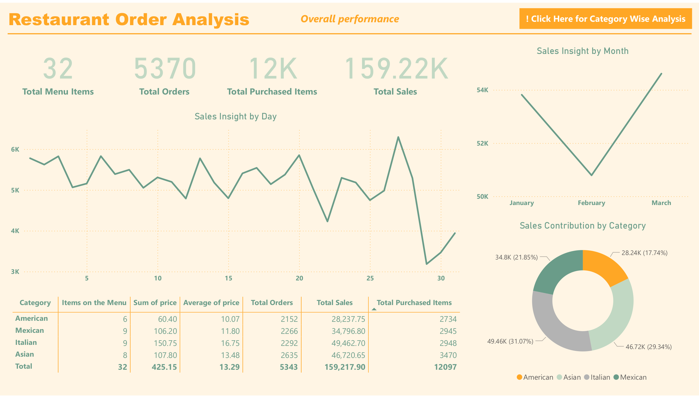
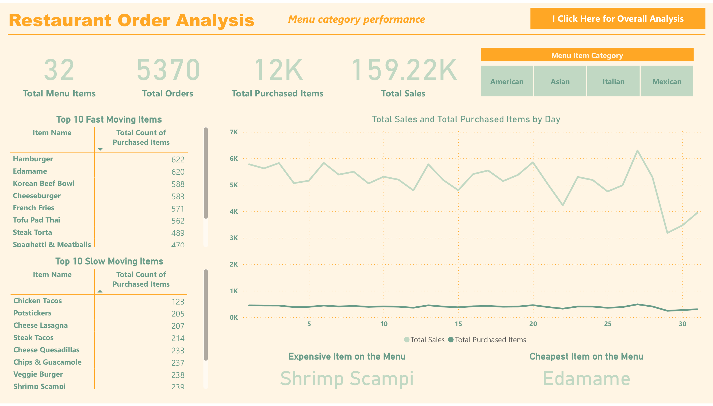

# Restaurant Order Analysis
## Live Report
**View the live interactive Power BI report here:**
[Click to Open Report](https://app.powerbi.com/view?r=eyJrIjoiZmExZDA5N2ItMjkxZS00ZmRiLWJjNzItOTkzMmI3MTcyMzRjIiwidCI6IjI1Y2UwMjYxLWJiZDYtNDljZC1hMWUyLTU0MjYwODg2ZDE1OSJ9&pageName=fdfe3d5b002870d3470c)  
*(Hosted on Power BI Service)*

## 📌 **Project Overview**
This project analyzes restaurant order data and provide valuable insights through interactive visualizations in Power BI, assisting in strategic decision making for operational improvement.
## 📊 **Key Insights**
- Menu Analysis: Breakdown of items by category (e.g., American, Asian, Italian, Mexican) with pricing insights.
- Order Insights: Identification of fast-moving and slow-moving items to optimize menu offerings.
- Sales Metrics: Trends in total sales and purchased items by day and month, supporting timebased strategies.
- Category Contribution: Sales contributions segmented by food category, highlighting performance strengths.
## 🗂 **Dataset Information**
- **Source:** Kaggle Sales Dataset  
- **Records:** 50,000 transactions  
- **Time Period:** 2019-2024  
- **Columns:** Date, Product, Category, Sales, Profit, Region, etc.
## ⚒ **Tools & Technologies Used**
- Power BI (Data Modeling/Data Visualization)  
- Power Query (Data Extracting/Data Cleaning)
## 🚀 **Project Workflow**
1.**Data Collection and Preparation**
  - Gather all raw restaurant order data from relevant sources.
  - Clean and preprocess the data to remove inconsistencies or errors.
  - Perform initial exploratory data analysis to understand data patterns and structure.

2.**Data Modeling and Analysis**
  - Load the cleaned data into Power BI Desktop for processing.
  - Create calculated columns and measures for insights (e.g., total sales, fastmoving items).
  - Segment data by categories, time periods, and sales performance.

3.**Visualizations and Insights**
  - Design intuitive visual dashboards to represent key metrics
     - Menu analysis (fast and slow-moving items).
     - Sales insights by category, day, and month.
  - Ensure interactivity to enable dynamic exploration of the data.

4.**Results Interpretation**
  - Analyze the dashboards to draw actionable conclusions.
  - Highlight top-performing categories, slow-moving items, and seasonal trends.

5.**Recommendations and Reporting**
  - Compile findings into a clear and professional report.
  - Suggest strategies for menu optimization, marketing campaigns, and operational improvements.

6.**Deployment and Feedback**
  - Share the dashboard and report with stakeholders for review.
  - Incorporate feedback to refine visualizations or analysis.

## 📊 **Dashboard Preview**
  

 
## 🏗 **Project Structure**
📂 sales-performance-analysis/ 

  │-- 📁 data/ # Contains raw and processed datasets 
  
  │-- 📁 scripts/ # SQL queries & Python scripts 
  
  │-- 📁 reports/ # Power BI & Tableau dashboards 
  
  │-- 📁 images/ # Dashboard screenshots 
  
  │-- 📄 README.md # Project documentation
## 🔗 **How to Use**
1. Download the dataset from [this link](#).
2. Run the SQL queries from the `scripts/` folder to extract insights.
3. Open the Power BI file (`reports/sales_dashboard.pbix`) to view dashboards.

---

## 📌 **Future Improvements**
- Add machine learning models for sales forecasting.
- Include customer segmentation analysis.

---

## 📜 **References**
- Kaggle Dataset: [Sales Data](#)
- Power BI Documentation: [Learn More](https://learn.microsoft.com/power-bi/)

